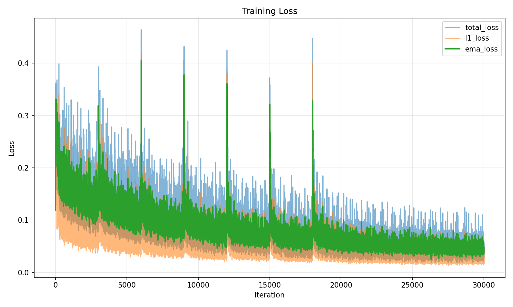

目标: 复现 3DHGS 关于 Tanks & Temples 数据集中 train 场景的训练和渲染, 并与 3DGS 和 Ground Truth 进行对比

输入与输出数据统一存放于 `data` 文件夹下.

### 1. 下载数据集

于 `data/raw` 中下载:

1. 3DGS 开发者维护的 Tanks & Temples 数据集的 COLMAP 格式 `tandt_db.zip`
2. 3DGS 开发者提供的 3DGS 渲染结果 (用于后续对比) `images.zip`

下载链接分别为:

- <https://repo-sam.inria.fr/fungraph/3d-gaussian-splatting/datasets/input/tandt_db.zip> (大小约 652M, sha1: `f4fa6b3c14d7a285b38a456e964cff3d698adbba`)
- <https://repo-sam.inria.fr/fungraph/3d-gaussian-splatting/evaluation/images.zip> (大小约 6.6G, sha1: `7d382d88d31e1cfb4bf4fb286e4edd69f20481c6`)

### 2. 准备训练输入

解压 `tandt_db.zip` 中的 `tandt/train` 目录到 `data/input` 目录:

```bash
unzip data/raw/tandt_db.zip "tandt/train/*" -d data/input
```

```bash
data/input
└── tandt
    └── train
        ├── images                  # 不同角度的原始输入图片
        │   ├── 00001.jpg
        │   ├── 00002.jpg
        │   ├── (...)
        │   └── 00301.jpg
        └── sparse                  # 相机位置等元数据
            └── 0
                ├── cameras.bin     
                ├── images.bin
                ├── points3D.bin
                └── project.ini

6 directories, 305 files
```

### 3. 构建训练环境

原仓库提供的 `environment.yaml` 并不符合可复现性的工程规范, 已补全为如下锁定 nvcc 和 gcc 版本的环境描述文件, 可在最高 `sm89` 代 NVIDIA GPU 上训练:

```yaml
name: half_gaussian_splatting
channels:
  - nvidia
  - pytorch
  - conda-forge
  - defaults
dependencies:
  - cuda-cudart-dev=11.6.55
  - cuda-nvcc=11.6.55
  - cudatoolkit=11.6
  - gcc_linux-64=10
  - gxx_linux-64=10
  - libxcrypt
  - mkl<2024
  - ninja
  - pillow=9.2.0
  - libtiff=4.4.0
  - plyfile
  - python=3.7.13
  - pip=22.3.1
  - pytorch=1.12.1
  - torchaudio=0.12.1
  - torchvision=0.13.1
  - tqdm
  - matplotlib
  - pip:
    - submodules/diff-gaussian-rasterization
    - submodules/simple-knn
    - lpips==0.1.4
    - scipy==1.7.3
```

由于本人手头没有如此老的 GPU, 因此修改了一份可以在 `NVIDIA H100` 上训练的版本. 不过由于仓库内自定义的 cuda 算子并没有很好考虑在 Hopper 系列上的运行效率, 因此训练速度仅有 CPU 训练的 2 倍左右, 不推荐使用.

```yaml
name: half_gaussian_splatting_h100
channels:
  - pytorch
  - nvidia
  - conda-forge
  - defaults
dependencies:
  - python=3.10
  - pip
  - pytorch::pytorch=2.5.*
  - pytorch::torchvision=0.20.*
  - pytorch::torchaudio=2.5.*
  - pytorch::pytorch-cuda=12.4
  - nvidia::cuda-nvcc=12.4
  - nvidia::cuda-cudart-dev=12.4
  - nvidia::cuda-toolkit=12.4
  - gcc_linux-64=11
  - gxx_linux-64=11
  - libxcrypt
  - mkl
  - ninja
  - numpy<2
  - scipy
  - pillow
  - libtiff
  - plyfile
  - tqdm
  - matplotlib
  - tensorboard
  - pip:
    - setuptools<70
    - wheel
    - lpips==0.1.4
```

随后安装并激活对应的 conda 环境, 后续操作均在该环境下进行:

```bash
# <= sm89 版本
conda env create --file environment.yml
conda activate half_gaussian_splatting
# > sm89 版本
conda env create --file environment_h100.yml
conda activate half_gaussian_splatting_h100
```

### 4. 训练并渲染结果

修改 `train.py` 以保留训练中的 loss 曲线和图表: (参见 commit: `19d55a1`)

随后运行训练:

```bash
# 多 GPU 环境下可以指定单个 GPU 运行
export CUDA_DEVICE_ORDER=PCI_BUS_ID 
export CUDA_VISIBLE_DEVICES=0
python train.py -s data/input/tandt/train --eval -m data/output/tandt/train 2>&1 | tee train.log
```

其中 `--eval` 参数会按如下规则切分训练集和测试集: 按图片名排序后，每 8 张取 1 张做 test/validation，其余做 train。

在 H100 上, 训练速度约为 30~50 it/s, 30000 iteration 的耗时约为 10~15 分钟. 训练结束后有目录:

```bash
data/output/tandt/train
├── cameras.json
├── cfg_args
├── events.out.tfevents.1782096340.sigma106.2608243.0
├── input.ply
├── point_cloud
│   └── iteration_30000
├── tensor_data.npy
├── train_loss.csv
└── train_loss_curve.png
```

此外, 本人复现时的训练日志和 loss 曲线也一并附于仓库中: `docs/train.log`. 



### 5. 渲染结果与对比指标

先使用仓库自带的测试脚本 `test_and_score.py` 不会遵循训练脚本的 `--eval` 参数进行测试, 因此本人自行实现了一份自动切训练测试集且分开计算的评估脚本 `test_and_score_eval.py`. 运行:

```bash
python test_and_score_eval.py -s data/input/tandt/train -m data/output/tandt/train
```

iteration 为 30000, 渲染过程约 6~7 it/s, 全程耗时约 1 分钟, 最终结果为:

```
Rendering train progress: 100%|██████████████████████████████████████████████████████████████████████████████████████████████████████████████████████████████████████████| 263/263 [00:45<00:00,  5.80it/s]
Train views= 263 [22/06 11:19:08]
Train PSNR= tensor(27.1116, device='cuda:0', dtype=torch.float64) [22/06 11:19:08]
Train SSIM= tensor(0.8921, device='cuda:0', dtype=torch.float64) [22/06 11:19:08]
Train LPIPS= tensor(0.1567, device='cuda:0', dtype=torch.float64) [22/06 11:19:08]
Rendering test progress: 100%|█████████████████████████████████████████████████████████████████████████████████████████████████████████████████████████████████████████████| 38/38 [00:06<00:00,  6.20it/s]
Test views= 38 [22/06 11:19:14]
Test PSNR= tensor(22.8161, device='cuda:0', dtype=torch.float64) [22/06 11:19:14]
Test SSIM= tensor(0.8321, device='cuda:0', dtype=torch.float64) [22/06 11:19:14]
Test LPIPS= tensor(0.1885, device='cuda:0', dtype=torch.float64) [22/06 11:19:14]
Combined views= 301 [22/06 11:19:14]
Combined PSNR= tensor(26.5693, device='cuda:0', dtype=torch.float64) [22/06 11:19:14]
Combined SSIM= tensor(0.8845, device='cuda:0', dtype=torch.float64) [22/06 11:19:14]
Combined LPIPS= tensor(0.1607, device='cuda:0', dtype=torch.float64) [22/06 11:19:14]
```

测试集上的 PSNR 读得为 `22.8161`, 与论文 Table 3 中作者给出的 PSNR 结果 `22.65` 相近.

生成的渲染图片位于 `data/output/tandt/train/{test,train}` 中, 具有子目录结构 `ours_30000/{gt,renders}` 分别代表 Ground Truth 和生成的渲染图片.

### 6. 生成对比图

从 3DGS 的结果中抽取 t&t 数据集的 train 场景的结果:

```bash
unzip data/raw/images.zip "train/test/ours_30000/*" -d data/3dgs_test_ours_30000
```

```
data/3dgs_test_ours_30000
└── train
    └── test
        └── ours_30000
            ├── gt
            │   ├── 00001.png
            │   ├── 00009.png
            │   ├── (...)
            │   └── 00297.png
            └── renders
                ├── 00001.png
                ├── 00009.png
                ├── (...)
                └── 00297.png

6 directories, 76 files
```

编写脚本 (`scripts/make_3dgs_3dhgs_gt_comparisons.py`) 按照论文中的图片顺序, 生成 `3D-GS, 3D-HGS, Ground-Truth` 三联横向拼合图片:

```bash
python scripts/make_3dgs_3dhgs_gt_comparisons.py --output-dir data/comparisons/tandt/train/
```

在输出目录下可以得到 38 张测试集的对比图片. 人眼观察可知 00017.png 即为论文 Figure 8 中使用的对比图片. 但是 3DGS 的图片看起来和论文中的不一致, 大概需要研究一下到底用了几个 iteration 的结果.
